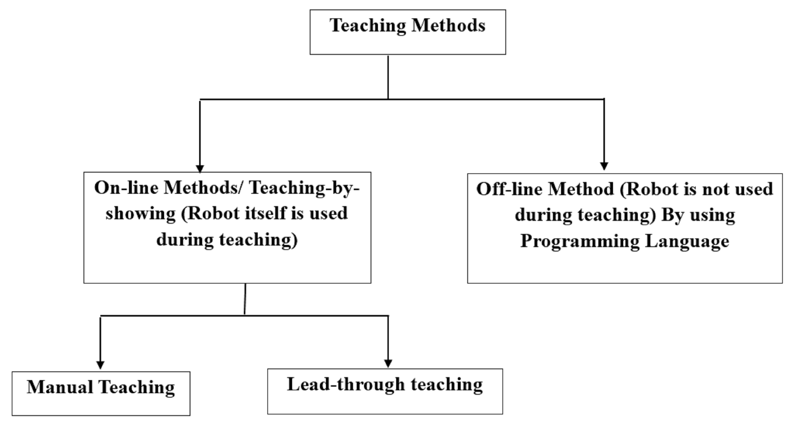
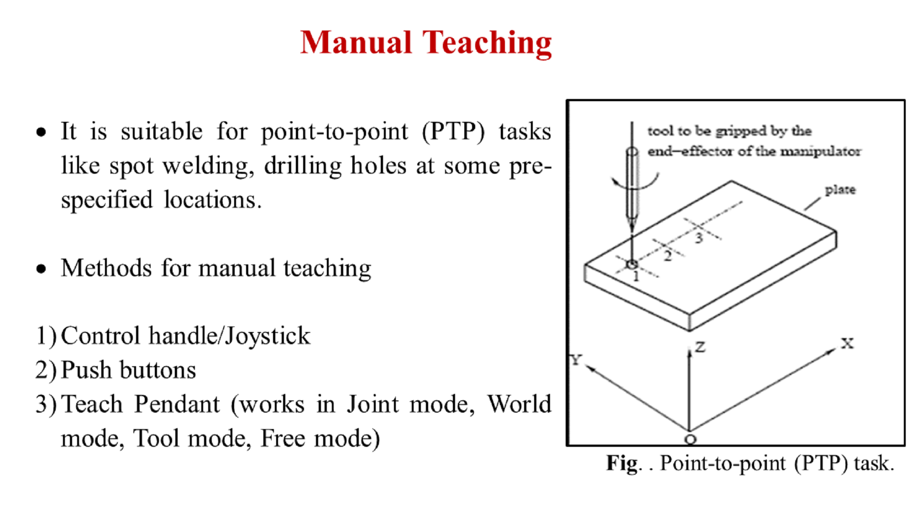

# Introduction

The PUMA 560 is an industrial robot arm with six degrees of freedom and all rotational joints. This experiment introduces the main features of VAL programming language for the PUMA-560 robotic manipulator. The VAL commands are used for offline programming based teaching of the robot. The theory section explains the teaching methods and VAL commands of the robot. In the simulation section, a virtual model is developed in the javascript program which is used to perform the programming experiment. For more information on other aspects of PUMA 560 and robotics, visitors are advised to follow the references.

***Figure 1: PUMA 560***

# Theory

Programmable Universal Machine for Assembly, more popularly known as PUMA is an industrial robot arm developed by Victor Scheinman at Unimation, in the year 1978. PUMA comes in various makes viz. PUMA 260, PUMA 560, PUMA 761 etc. The PUMA robot is connected to a 1980 series controller that has a programming language called VAL II which translates simple commands into the electrical signals needed to drive the robot. The commands are send to the controller using a serial port from a PC/Computer.

## General Steps to start a PUMA560 Robotic System:

## Laptop/PC Setup Procedure:

To operate the PUMA we must first be sure that the PC or laptop/PC is running and that a serial connection is established so that we can enter commands directly. When the power for the PUMA controller is first turned on, it will ask specific questions that need to be answered before power will be applied to the arm. Without the computer connection, the robot arm will not function.

Follow these steps to bring the laptop/PC online before the PUMA is switched on.

1. Press the POWER switch on the laptop/PC.
2. When prompted, enter the password and press Enter.
3. Once the laptop/PC is completely powered up locate the icon for HYPERTERMINAL which is a simple terminal program. This is what we will use to communicate with the PUMA.
4. Double click on the HYPERTERMINAL icon to start the program.
5. The terminal program should start up and already be configured for the proper settings.
6. Power the PUMA Robot Controller on.

**Note: If you are unable to communicate in the following steps, you may need to manually set the software to the following values.**

1. Select the Communication Port (This depends on the laptop/PC you use. Example: COM1/COM2)

2. Set 9600 Baud, no parity, 1 stop bit.

3. 250 ms delay after a line feed. (This is important when sending files.)

4. 0 ms delay after a character.

## Robot Power ON Procedure:

Once the laptop/PC is running follow these procedures.

***Figure 2: PUMA 560 Controller.***

1. Locate the switch marked RESTART/HALT/RUN and make sure it is in the RUN position.
2. Turn the POWER ON switch to the UP position.
3. On the laptop/PC you should get the first response from the puma INITILIZE (Y/N) ?
You need to answer Y or N to continue, the default answer is N press Enter. If you answer Y to this question, all programs will be erased, the speed will be set to 100%, and all location names will be erased. If you need to clear out all memory to start over, then you would answer Y press Enter.
4. After the question is answered, press the ARM POWER button.
5. You will hear a click and all joints of the robot will now freeze, you will no longer be able to freely move the gripper by pressing on it.
6. Do the PUMA CALIBRATION PROCEDURE using VAL command "CALI"

## Robot Power OFF Procedure:

1. Press the red ARM POWER OFF switch.
2. Turn the POWER ON switch to the DOWN position.
3. Power off the laptop/PC if not being used.

**WARNING: Turning the controller OFF before pressing the RED ARM POWER OFF switch may damage the driver boards of the robot controller. Always press the RED ARM POWER OFF switch first!**

## Teaching Methods :

## Robot Programming (off-line method) :

## PUMA VAL Command Structure:

The PUMA robot will respond to a series of commands in a language called VAL II. There are two methods of sending the commands; first is from within a program, the other is by manually entering them into the computer.

Example: The command to make the arm go to the default position is READY. From within a program you can issue the command directly:

### READY

From the terminal you must issue a sub-command to inform the robot to access the command structure, the sub-command is DO. To make the robot move to the default position from the terminal program you would enter:

### DO READY

In the following text it will be presumed that the commands are being used from within a computer program. If you are entering them manually use the DO sub-command or you will get an error message.

***List of VAL commands:*** The PUMA has several commands which are used in the creation of programs by the user. Here only a brief description of each of the major commands is listed to help you with making your own programs. For more detailed information you should download and read the VAL Programming Manual from referance tab:

**CALI:** Used for the calibration of robot.
**DO READY:** Takes the robot to home position from current location.
**DO DRIVE:** Used for moving individual joint.
**HERE:** Used to save robot current position MOVE: Used to command the end-effector to move form one pre-defined point to another.

***DO DRIVE*** Used to directly move a specified joint jt a specified number of degrees degrees and at a specified maximum speed speed. This command can be used to move from a known location such as the READY position to a new location in the initial setup of the machine, or it can be used to move a specific joint to assist in alignment.

Use: **DO DRIVE JT, degrees, speed**

Example: DO DRIVE 3, 40, 50

## Puma kinematic diagrams:

### Table 1. Puma 560 D-H parameter table

| $$ Link_i $$ | $$	\\alpha_{i-1} $$ | $$ a_{i-1}(m) $$ | $$ d_i (m) $$ | $$ \\theta_i $$ |
| :-- | :-- | :-- | :-- | :-- |
| $$ 1 $$ | $$ 0 $$ | $$ 0 $$ | $$ 0 $$ | $$ \\theta_1 $$ |
| $$ 2 $$ | $$ -90 $$ | $$ 0 $$ | $$ 0 $$ | $$ \\theta_2 $$ |
| $$ 3 $$ | $$ 0 $$ | $$ a_2 $$ | $$ d_3 $$ | $$ \\theta_3 $$ |
| $$ 4 $$ | $$ -90 $$ | $$ a_3 $$ | $$ d_4 $$ | $$ \\theta_4 $$ |
| $$ 5 $$ | $$ 90 $$ | $$ 0 $$ | $$ 0 $$ | $$ \\theta_5 $$ |
| $$ 6 $$ | $$ -90 $$ | $$ 0 $$ | $$ 0 $$ | $$ \\theta_6 $$ |

### Transformation matrices of six joints for Puma 560 robot

$$ T_1 = \\begin{bmatrix} cos(\\theta_1) & -sin(\\theta_1) & 0 & 0 \\\ sin(\\theta_1) & cos(\\theta_1) & 0 & 0 \\\ 0 & 0 & 1 & 0 \\\ 0 & 0 & 0 & 1 \\\ \\end{bmatrix} \\quad T_2 = \\begin{bmatrix} cos(\\theta_2) & -sin(\\theta_2) & 0 & 0 \\\ 0 & 0 & 1 & 0 \\\ -sin(\\theta_2) & -cos(\\theta_2) & 0 & 0 \\\ 0 & 0 & 0 & 1 \\\ \\end{bmatrix} $$

$$ T_3 = \\begin{bmatrix} cos(\\theta_3) & -sin(\\theta_3) & 0 & a_2 \\\ sin(\\theta_3) & cos(\\theta_3) & 0 & 0 \\\ 0 & 0 & 1 & d_3 \\\ 0 & 0 & 0 & 1 \\\ \\end{bmatrix} \\quad T_4 = \\begin{bmatrix} cos(\\theta_4) & -sin(\\theta_4) & 0 & a_3 \\\ 0 & 0 & 1 & d_4 \\\ -sin(\\theta_4) & -cos(\\theta_4) & 0 & 0 \\\ 0 & 0 & 0 & 1 \\\ \\end{bmatrix} $$

$$ T_5 = \\begin{bmatrix} cos(\\theta_5) & -sin(\\theta_5) & 0 & 0 \\\ 0 & 0 & -1 & 0 \\\ sin(\\theta_5) & cos(\\theta_5) & 0 & 0 \\\ 0 & 0 & 0 & 1 \\\ \\end{bmatrix} \\quad T_6 = \\begin{bmatrix} cos(\\theta_6) & -sin(\\theta_6) & 0 & 0 \\\ 0 & 0 & 1 & 0 \\\ -sin(\\theta_6) & -cos(\\theta_6) & 0 & 0 \\\ 0 & 0 & 0 & 1 \\\ \\end{bmatrix} $$

### Final Transformation Matrix**

$$ T = T_1 * T_2 * T_3 * T_4 * T_5 * T_6 $$

**The orientation and position of the end effector with reference to the base coordinate is obtain from the final matrix**

$$ T = \\begin{bmatrix} n & s & a & p \\\ 0 & 0 & 0 & 1 \\\ \\end{bmatrix} = \\begin{bmatrix} n_x & s_x & a_x & p_x \\\ n_y & s_y & a_y & p_y \\\ n_z & s_z & a_z & p_z \\\ 0 & 0 & 0 & 1 \\\ \\end{bmatrix} $$

# Video

***PUMA560 Industrial Robot***

<video width="420" height="340" controls="" autoplay=""><source src="./images/puma560.mp4" type="video/mp4"></video>

